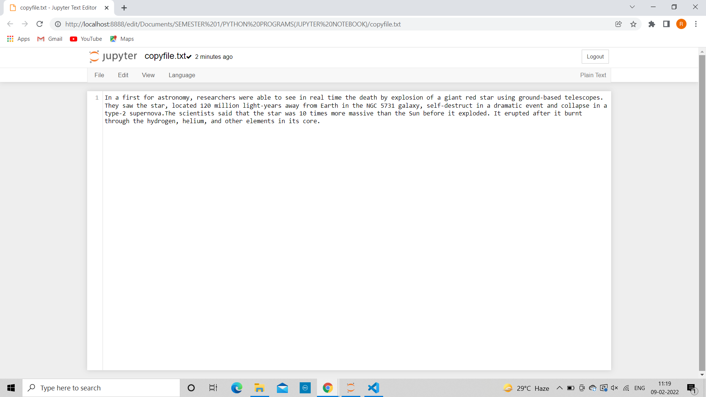

# COPY-FILE
## AIM:
To write a python program for copying the contents from one file to another file.
## EQUIPEMENT'S REQUIRED: 
PC
Anaconda - Python 3.7
## ALGORITHM: 
### Step 1: 
Start the Program.
### Step 2:
Open a file using with keyword/built -in function open() in read mode.
### Step 3: 
Read the content of the file using read().
### Step 4: 
Open another file in which the content must be copied in write mode.
### Step 5:  
Write the content from original file into copied file using write().
### Step 6: 
End the Program.
## PROGRAM:
```
Developed by:Rithiga Sri.B
Registration Number:21500732
with open("wordcount.txt","r") as fp:
    data=fp.read()
with open("copyfile.txt","w") as fp1:
    fp1.write(data)
```

### OUTPUT:



## RESULT:
Thus the program is written to copy the contents from one file to another file.